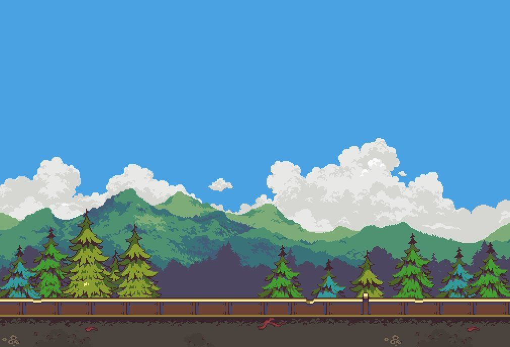

# 🌸 Kajol Sunar — Interactive Retro OS Portfolio

[](https://about-me-flame-five.vercel.app/)
[](https://www.linkedin.com/in/kajol-sunar-ks/)
[](https://github.com/Ks1540/ABOUT-ME)
[](https://react.dev/)
[](https://vitejs.dev/)
[](https://tailwindcss.com/)

> 🌐 **Live Website:** [https://about-me-flame-five.vercel.app/](https://about-me-flame-five.vercel.app/)

A retro desktop operating system simulator portfolio built with **React**, **Vite**, and **Tailwind CSS**. Features interactive draggable windows, custom pixel art icons, synthesized 8-bit sound effects, a functional command-line terminal, dark/light theme switching, and live project highlights.



---

## ✨ Features

- 🖥️ **Interactive Desktop Environment**: Draggable windows with minimize, maximize, restore, and close window controls powered by `react-draggable`.
- 🌸 **Retro Taskbar & Start Menu**: Classic OS taskbar with active window switcher, digital clock, and animated popup Start Menu.
- 💻 **Interactive CLI Terminal**: Functional command prompt (`help`, `about`, `projects`, `skills`, `sudo hire`, `clear`).
- 🔊 **Web Audio Synthesizer**: Zero-dependency 8-bit click sound synthesis via the native browser `AudioContext` API.
- 🌓 **Dynamic Theme Switching**: Seamless dark and light mode toggle with customized retro wallpapers.
- 📄 **Embedded PDF Resume**: In-app PDF viewer with direct open and download options.
- 📬 **Resilient Contact Form**: Full-stack message transmission with automatic mailto fallback and clipboard actions.

---

## 🛠️ Tech Stack

- **Frontend**: React 18, Vite, Tailwind CSS, Framer Motion, React-Draggable
- **Backend**: Node.js, Express, Nodemailer, CORS, Dotenv
- **Typography & Styling**: Google Fonts (Space Grotesk, JetBrains Mono, Inter), Custom SVG Pixel Icons

---

## 🚀 Getting Started

### 1. Clone the repository
```bash
git clone https://github.com/Ks1540/ABOUT-ME.git
cd ABOUT-ME
```

### 2. Install dependencies
```bash
npm install
```

### 3. Run the development server
```bash
npm run dev
```

The portfolio will be live at `http://localhost:5173`.

### 4. (Optional) Run the backend mail server
```bash
cp .env.example .env
# Fill in your Gmail App Password credentials in .env
npm run server
```

### 5. Build for production
```bash
npm run build
```

---

## 👩‍💻 Author

**Kajol Sunar**
- 🎓 B.Tech Computer Science & Engineering
- 💼 LinkedIn: [Kajol Sunar](https://www.linkedin.com/in/kajol-sunar-ks/)
- 🐙 GitHub: [@Ks1540](https://github.com/Ks1540)
- 📧 Email: [kajolsunar1292@gmail.com](mailto:kajolsunar1292@gmail.com)
